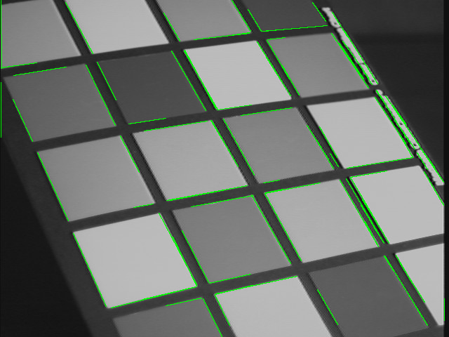
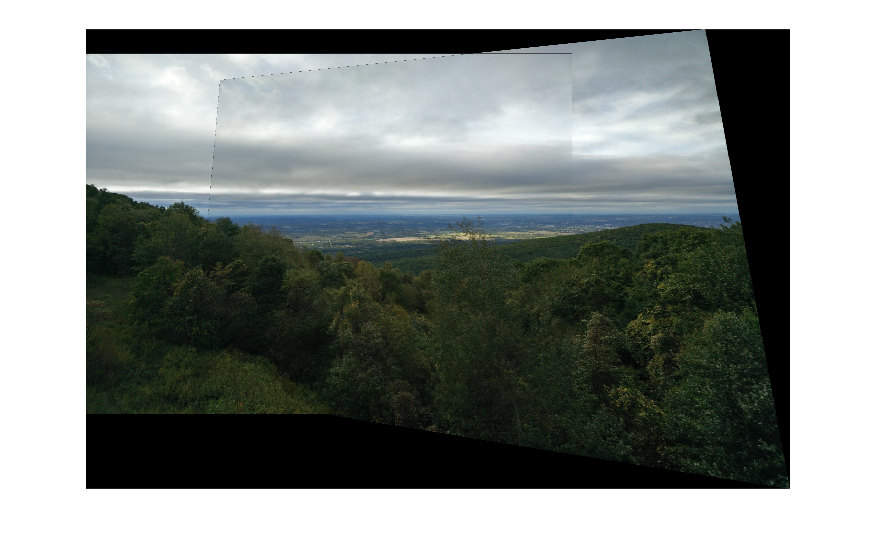
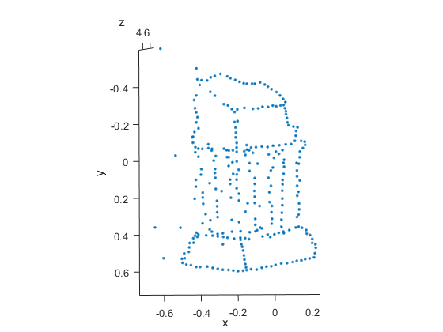
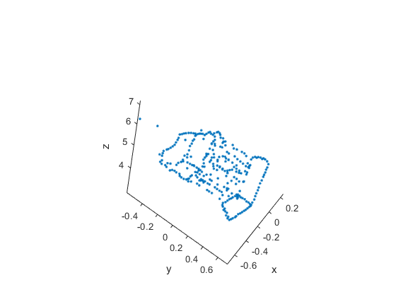
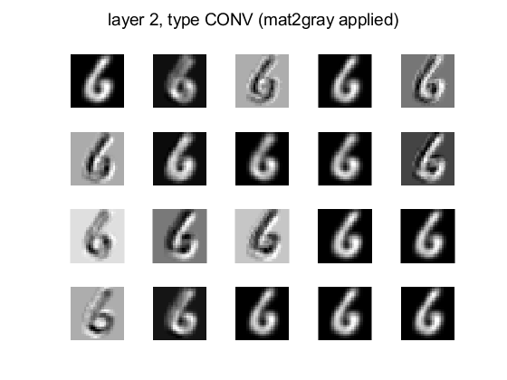
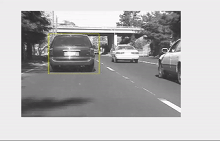
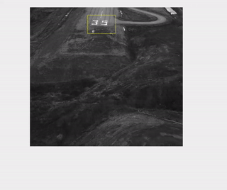

# Foundations of Computer Vision
HKUST 2019-2020 Fall COMP4901L 
(course adapted from [CMU 16-385 Computer Vision](http://www.cs.cmu.edu/~16385/))

## Assignment 1
### Image Filtering and Hough Transform

<table>
  <tr>
    <th colspan="2">Edge detection</th>
  </tr>
  <tr>
    <th>Input</th>
    <th>Output</th>
  </tr>
  <tr>
    <td align="center"></td>
    <td align="center"></td>
  </tr>
</table>

## Assignment 2
### Augmented Reality with Planar Homographies

<table>
  <tr>
    <th colspan="2">AR</th>
  </tr>
    <td align="center">Original video</td>
    <td align="center">Output</td>
  <tr>
    <td align="center"></td>
    <td align="center"></td>
  </tr>
  <tr>
    <th colspan="2">Panorama</th>
  </tr>
  </tr>
    <td align="center">Input</td>
    <td align="center">Output</td>
  <tr>
  <tr>
    <td align="center">
      
      
    </td>
    <td align="center">
      
    </td>
  </tr>
</table>

References:
- Fusing Points and Lines for High Performance Tracking, E. Rosten and T. Drummond, ICCV 2005
- Machine learning for high-speed corner detection, E. Rosten and T. Drummond, ECCV 2006

## Assignment 3
### 3D Reconstruction

<table>
  <tr>
    <th>Input</th>
    <th>Output 3D points</th>
  </tr>
  <tr>
    <td align="center">
      
      
       with some known correspondences
    </td>
    <td align="center">
      
      
    </td>
  </tr>
</table>

## Assignment 5
### Scene Recognition with Bag of Words

<table>
  <tr>
    <th colspan="4">Results</th>
  </tr>
  <tr>
    <th colspan="2">Settings</th>
    <th colspan="2">Confusion matrix</th>
  </tr>
  <tr>
    <td>Feature descriptor</td>
    <td>HOG</td>
    <td rowspan="7" colspan="2" align="center">
        <table>
        <tr>
            <td>airport</td>
            <td>13</td>
            <td>2</td>
            <td>1</td>
            <td>3</td>
            <td>1</td>
            <td>0</td>
            <td>0</td>
            <td>0</td>
        </tr>
        <tr>
            <td>auditorium</td>
            <td>2</td>
            <td>14</td>
            <td>3</td>
            <td>0</td>
            <td>1</td>
            <td>0</td>
            <td>0</td>
            <td>0</td>
        </tr>
        <tr>
            <td>bedroom</td>
            <td>0</td>
            <td>0</td>
            <td>19</td>
            <td>0</td>
            <td>0</td>
            <td>0</td>
            <td>1</td>
            <td>0</td>
        </tr>
        <tr>
            <td>campus</td>
            <td>3</td>
            <td>0</td>
            <td>0</td>
            <td>16</td>
            <td>0</td>
            <td>0</td>
            <td>0</td>
            <td>1</td>
        </tr>
        <tr>
            <td>desert</td>
            <td>0</td>
            <td>1</td>
            <td>0</td>
            <td>0</td>
            <td>17</td>
            <td>0</td>
            <td>2</td>
            <td>0</td>
        </tr>
        <tr>
            <td>football stadium</td>
            <td>0</td>
            <td>4</td>
            <td>0</td>
            <td>1</td>
            <td>2</td>
            <td>11</td>
            <td>2</td>
            <td>0</td>
        </tr>
        <tr>
            <td>landscape</td>
            <td>0</td>
            <td>1</td>
            <td>0</td>
            <td>0</td>
            <td>0</td>
            <td>0</td>
            <td>18</td>
            <td>1</td>
        </tr>
        <tr>
            <td>rainforest</td>
            <td>0</td>
            <td>0</td>
            <td>0</td>
            <td>0</td>
            <td>0</td>
            <td>0</td>
            <td>0</td>
            <td>20</td>
        </tr>
        </table>
        entry (i,j) indicates the number of images of actual class i classified as class j
    </td>
  </tr>
  <tr>
    <td>Pixel selection method</td>
    <td>Random</td>
  </tr>
  <tr>
    <td>Number of pixels selected</td>
    <td>100</td>
  </tr>
  <tr>
    <td>Dictionary clusters</td>
    <td>100</td>
  </tr>
  <tr>
    <td>Classifier</td>
    <td>Linear SVM</td>
  <tr>
    <th colspan="2">Accuracy</th>
  </tr>
  <tr>
    <td colspan="2" align="center">0.8000</td>
  </tr>
</table>

References:
- [SUN Database](https://groups.csail.mit.edu/vision/SUN/)

## Assignment 6
### Digit Recognition with Convolutional Neural Networks

LeNet architecture used

<table>
  <tr>
    <th colspan="2">Results</th>
  </tr>
  <tr>
    <th colspan="2">Sample output</th>
  </tr>
  <tr>
    <td align="center">Layer 2 (type CONV)</td>
    <td align="center">Layer 3 (type RELU)</td>
  </tr>
  <tr>
    <td></td>
    <td></td>
  </tr>
  <tr>
      <th colspan="2">Confusion matrix</th>
  </tr>
  <tr>
      <td colspan="2" align="center">
        <table>
        <tr>
            <td>digit</td>
            <td colspan="10"></td>
        </tr>
        <tr>
            <td>0</td>
            <td>44</td>
            <td>0</td>
            <td>0</td>
            <td>0</td>
            <td>0</td>
            <td>0</td>            
            <td>2</td>
            <td>1</td>
            <td>0</td>
            <td>0</td>
        </tr>
        <tr>
            <td>1</td>
            <td>0</td>
            <td>53</td>
            <td>0</td>
            <td>0</td>
            <td>0</td>
            <td>0</td>            
            <td>0</td>
            <td>1</td>
            <td>0</td>
            <td>0</td>
        </tr>
        <tr>
            <td>2</td>
            <td>1</td>
            <td>0</td>
            <td>50</td>
            <td>3</td>
            <td>0</td>
            <td>0</td>            
            <td>0</td>
            <td>1</td>
            <td>0</td>
            <td>0</td>
        </tr>
        <tr>
            <td>3</td>
            <td>0</td>
            <td>0</td>
            <td>0</td>
            <td>32</td>
            <td>0</td>
            <td>1</td>            
            <td>0</td>
            <td>2</td>
            <td>2</td>
            <td>0</td>
        </tr>
        <tr>
            <td>4</td>
            <td>0</td>
            <td>0</td>
            <td>0</td>
            <td>0</td>
            <td>51</td>
            <td>0</td>            
            <td>0</td>
            <td>0</td>
            <td>0</td>
            <td>0</td>
        </tr>
        <tr>
            <td>5</td>
            <td>0</td>
            <td>0</td>
            <td>0</td>
            <td>1</td>
            <td>0</td>
            <td>40</td>            
            <td>1</td>
            <td>0</td>
            <td>0</td>
            <td>1</td>
        </tr>
        <tr>
            <td>6</td>
            <td>2</td>
            <td>0</td>
            <td>0</td>
            <td>0</td>
            <td>0</td>
            <td>0</td>            
            <td>41</td>
            <td>0</td>
            <td>0</td>
            <td>0</td>
        </tr>
        <tr>
            <td>7</td>
            <td>0</td>
            <td>0</td>
            <td>2</td>
            <td>0</td>
            <td>0</td>
            <td>1</td>            
            <td>0</td>
            <td>56</td>
            <td>0</td>
            <td>2</td>
        </tr>
        <tr>
            <td>8</td>
            <td>0</td>
            <td>0</td>
            <td>1</td>
            <td>1</td>
            <td>0</td>
            <td>0</td>            
            <td>1</td>
            <td>0</td>
            <td>48</td>
            <td>0</td>
        </tr>
        <tr>
            <td>9</td>
            <td>0</td>
            <td>1</td>
            <td>0</td>
            <td>1</td>
            <td>2</td>
            <td>0</td>            
            <td>0</td>
            <td>0</td>
            <td>0</td>
            <td>54</td>
        </tr>
        </table>
    </td>
  </tr>
  <tr>
    <th colspan="2">Accuracy</th>
  </tr>
  <tr>
    <td colspan="2" align="center">0.9380</td>
  </tr>
</table>

References:
- [MNIST Database](http://yann.lecun.com/exdb/mnist/)
- Y. Lecun, L. Bottou, Y. Bengio et al., "Gradient-based learning applied to document recognition", Proc. IEEE, vol. 86, no. 11, pp. 2278-2324, 1998.

## Assignment 7
### Tracking Objects in Videos

<table>
  <tr>
    <th colspan="2">Results</th>
  </tr>
  <tr>
    <th>Lucas-Kanade (forward additive alignment)</th>
    <th>Matthew-Baker (inverse compositional alignment)</th>
  </tr>
  <tr>
    <td align="center">
       
      (translation)
    </td>
    <td align="center">
       
      (affine)
    </td>
  </tr>
</table>